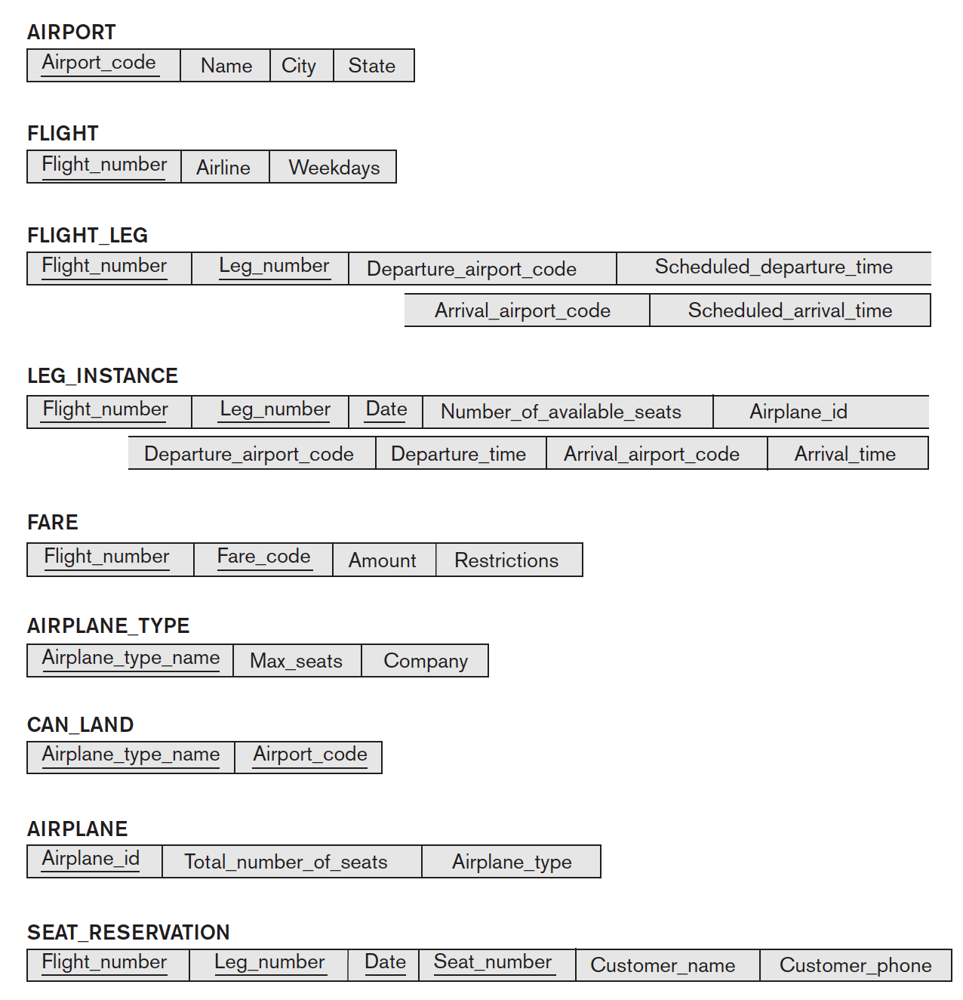

# Chapter 8 - Review Questions

## Review Questions

**6.1.** How do the relations (tables) in SQL differ from the relations defined formally in Chapter 3? Discuss the other differences in terminology. Why does SQL allow duplicate tuples in a table or in a query result?

Relations / table differ from the relations defined in Chapter 3 **chiefly** in the difference that SQL allows a table / relation to have two or more tuples that are identical in all of their values. Because of this, a SQL relation is **not** a _set of tuples_, but rather a **multiset** of tuples. This is also why SQL allows duplicate queries.

**6.2.** List the data types that are allowed for SQL attributes.

- **Numeric:** INTEGER, INT, SMALLINT, BIGINT, FLOAT, REAL, DOUBLE, DEC, NUMERIC
- **Character string:** CHAR, VARCHAR, CLOB
- **Bit string:** BIT, BIT VARYING
- **Boolean**
- **Date:** DATETIME, DATE, DURATION, TIMESTAMP

**6.3.** How does SQL allow implementation of the entity integrity and referential integrity constraints described in Chapter 3? What about referential triggered actions?

SQL implements entity and referential integrity constraints through the use of primary keys, unique keys, and foreign keys. For referential integrity, it is also possible to add CASCADE effects to foreign keys, whereby you can trigger actions that happen to dependent tables.

**6.4.** Describe the four clauses in the syntax of a simple SQL retrieval query. Show what type of constructs can be specified in each of the clauses. Which are required and which are optional?

The four clauses are:

- **SELECT**
- **FROM**
- **WHERE**
- **ORDER / GROUP BY**

## Exercises


**6.5.** Consider the database shown in Figure 1.2, whose schema is shown in Figure 2.1 (both above). What are the referential integrity constraints that should hold on the schema? Write appropriate SQL DDL statements to define the database.

```mysql
-- STUDENT
CREATE TABLE `STUDENT` (
  `Name` varchar(255) NOT NULL,
  `Student_number` int(8) unsigned NOT NULL,
  `Class` int(8) unsigned NOT NULL,
  `Major` varchar(16) DEFAULT NULL,
  CONSTRAINT `uk_STUDENT_Student_number` UNIQUE (`Student_number`)
);

-- COURSE
CREATE TABLE `COURSE` (
  `Course_name` varchar(255) NOT NULL,
  `Course_number` varchar(255) NOT NULL,
  `Credit_hours` int(4) NOT NULL,
  `Department` varchar(255) NOT NULL,
  CONSTRAINT `uk_COURSE_Course_number` UNIQUE (`Course_number`)
);

-- SECTION
CREATE TABLE `SECTION` (
  `Section_identifier` int(8) unsigned NOT NULL,
  `Course_number` varchar(255) NOT NULL,
  `Semester` enum('Spring', 'Summer', 'Fall', 'Winter') DEFAULT NULL,
  `Year` char(4) NOT NULL,
  `Instructor` varchar(255) NOT NULL,
  CONSTRAINT `uk_SECTION_Section_identifier_Course_number` UNIQUE (`Section_identifier`, `Course_number`),
  CONSTRAINT `fk_SECTION_Course_number_COURSE_Course_number` FOREIGN KEY (`Course_number`) REFERENCES `COURSE` (`Course_number`) ON DELETE CASCADE ON UPDATE CASCADE
);

-- PREREQUISITE
CREATE TABLE `PREREQUISITE` (
  `Course_number` varchar(255) NOT NULL,
  `Prerequisite_number` varchar(255) NOT NULL,
  PRIMARY KEY (`Course_number`, `Prerequisite_number`),
  CONSTRAINT `fk_PREREQUISITE_Course_number_COURSE_Course_number` FOREIGN KEY (`Course_number`) REFERENCES `COURSE` (`Course_number`) ON DELETE CASCADE ON UPDATE CASCADE,
  CONSTRAINT `fk_PREREQUISITE_Prerequisite_number_COURSE_Course_number` FOREIGN KEY (`Prerequisite_number`) REFERENCES `COURSE` (`Course_number`) ON DELETE CASCADE ON UPDATE CASCADE
);

-- GRADE_REPORT
CREATE TABLE `GRADE_REPORT` (
  `Student_number` int(8) unsigned NOT NULL,
  `Section_identifier` int(8) unsigned NOT NULL,
  `Grade` char(2) NOT NULL,
  CONSTRAINT `fk_GRADE_REPORT_Student_number_STUDENT_Student_number` FOREIGN KEY (`Student_number`) REFERENCES `STUDENT` (`Student_number`) ON DELETE CASCADE ON UPDATE CASCADE,
  CONSTRAINT `fk_GRADE_REPORT_Section_identifier_SECTION_Section_identifier` FOREIGN KEY (`Section_identifier`) REFERENCES `SECTION` (`Section_identifier`) ON DELETE CASCADE ON UPDATE CASCADE
);
```

**6.6.** Repeat Exercise 6.5, but use the AIRLINE database schema of Figure 5.8.



```mysql
-- AIRPORT
CREATE TABLE `AIRPORT` (
  `Airport_code` VARCHAR(6) NOT NULL,
  `Name` VARCHAR(255) NOT NULL,
  `City` VARCHAR(255) NOT NULL,
  `State` CHAR(2) NOT NULL,
  CONSTRAINT UNIQUE (`Airport_code`)
);

-- FLIGHT
CREATE TABLE `FLIGHT` (
  `Flight_number` VARCHAR(16) NOT NULL,
  `Airline` VARCHAR(255) NOT NULL,
  `Weekdays` VARCHAR(7) DEFAULT NULL,
  CONSTRAINT UNIQUE (`Flight_number`)
);

-- FLIGHT_LEG
CREATE TABLE `FLIGHT_LEG` (
  `Flight_number` VARCHAR(16) NOT NULL,
  `Leg_number` VARCHAR(16) NOT NULL,
  `Departure_airport_code` VARCHAR(6) NOT NULL,
  `Scheduled_departure_time` TIME(6) NOT NULL,
  `Arrival_airport_code` VARCHAR(6) NOT NULL,
  `Scheduled_arrival_time` TIME(6) NOT NULL,
  CONSTRAINT UNIQUE (`Leg_number`, `Flight_number`),
  CONSTRAINT FOREIGN KEY (`Flight_number`) REFERENCES `FLIGHT` (`Flight_number`) ON DELETE CASCADE ON UPDATE CASCADE,
  CONSTRAINT FOREIGN KEY (`Arrival_airport_code`) REFERENCES `AIRPORT` (`Airport_code`) ON DELETE CASCADE ON UPDATE CASCADE,
  CONSTRAINT FOREIGN KEY (`Departure_airport_code`) REFERENCES `AIRPORT` (`Airport_code`) ON DELETE CASCADE ON UPDATE CASCADE
);

-- AIRPLANE_TYPE
CREATE TABLE `AIRPLANE_TYPE` (
  `Airplane_type` VARCHAR(255) NOT NULL,
  `Max_seats` INT(8) NOT NULL,
  `Company` VARCHAR(255) NOT NULL,
  CONSTRAINT UNIQUE (`Airplane_type`)
);

-- AIRPLANE
CREATE TABLE `AIRPLANE` (
  `Airplane_id` INT(8) NOT NULL,
  `Total_number_of_seats` int(4) NOT NULL,
  `Airplane_type` VARCHAR(255) NOT NULL,
  CONSTRAINT UNIQUE (`Airplane_id`),
  CONSTRAINT FOREIGN KEY (`Airplane_type`) REFERENCES `AIRPLANE_TYPE` (`Airplane_type`) ON DELETE CASCADE ON UPDATE CASCADE
);

-- LEG_INSTANCE
CREATE TABLE `LEG_INSTANCE` (
  `Flight_number` VARCHAR(16) NOT NULL,
  `Leg_number` VARCHAR(16) NOT NULL,
  `Date` DATE NOT NULL,
  `Number_of_available_seats` INT(4) DEFAULT NULL,
  `Airplane_id`
);
```

